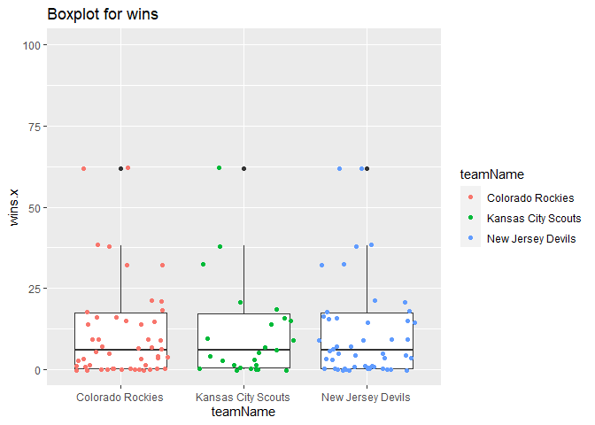
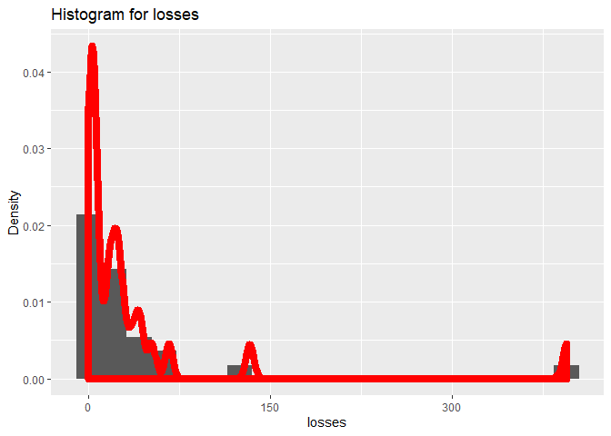
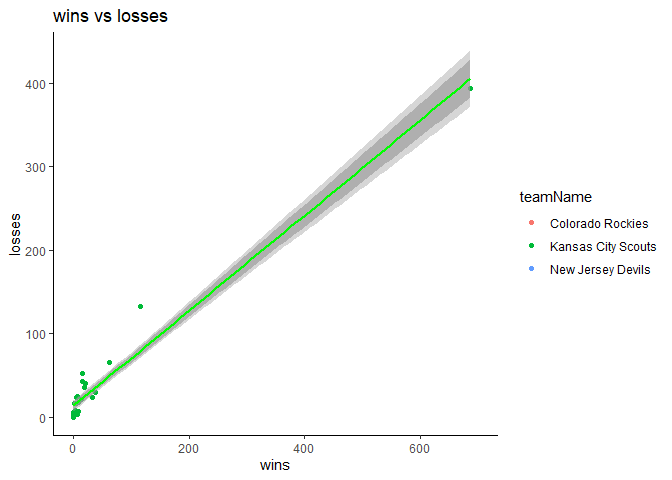
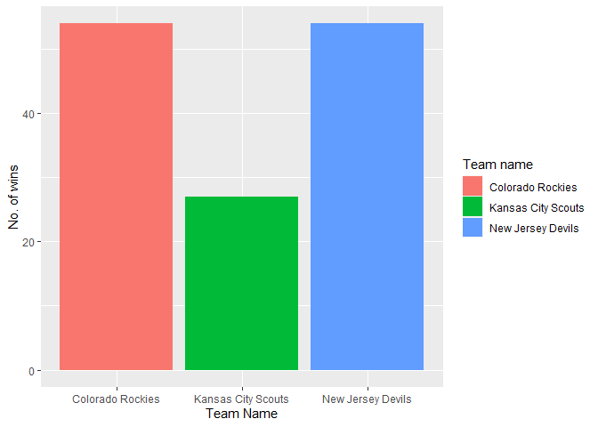

Project 1
================
Yumin Wu
2020-09-13

  - [Introduction](#introduction)
      - [Functions to contact the NHL records API and the NHL stats
        API.](#functions-to-contact-the-nhl-records-api-and-the-nhl-stats-api.)
      - [Create a function for users to access any of the API endpoints
        above.](#create-a-function-for-users-to-access-any-of-the-api-endpoints-above.)
      - [Data analysis](#data-analysis)
          - [New Jersey Devils summary of
            losses](#new-jersey-devils-summary-of-losses)
          - [New Jersey Devils summary of
            wins](#new-jersey-devils-summary-of-wins)
          - [New Jersey Devils summary of
            ties](#new-jersey-devils-summary-of-ties)
      - [Visuals](#visuals)

``` r
library(rmarkdown)
library(httr)
library(jsonlite)
library(dplyr)
library(knitr)
```

# Introduction

Read and summarize data from the National Hockey League’s (NHL) API.

## Functions to contact the NHL records API and the NHL stats API.

``` r
get_franchise <- function(id=NULL,name=NULL)
{
  get_franchise<-GET("https://records.nhl.com/site/api/franchise")
  txt_franchise<-content(get_franchise, "text")
  json_franchise<-fromJSON(txt_franchise,flatten = TRUE)
  franchise<-json_franchise$data%>%select("id","firstSeasonId","lastSeasonId","teamCommonName")
  
  if(is.null(id)&(is.null(name)))
  {
    return(franchise)
  }else{
      return(franchise[which((franchise$id %in% id)|(franchise$teamCommonName %in% name)),])
  }
}
```

``` r
get_franchisett<-function(franchiseId =NULL,teamName =NULL)
{
  get_franchisett<-GET("https://records.nhl.com/site/api/franchise-team-totals")
  txt_franchisett<-content(get_franchisett, "text")
 json_franchisett<-fromJSON(txt_franchisett,flatten = TRUE)
  franchise_team_total<-json_franchisett$data%>%select("franchiseId","homeTies","homeWins","roadTies","roadWins","shootoutLosses",
  "shootoutWins","shutouts","teamId","teamName","ties","wins")

   if(is.null(franchiseId)&(is.null(teamName)))
  {
    return(franchise_team_total)
  }else{
      return(franchise_team_total[which((franchise_team_total$franchiseId %in% franchiseId)|(franchise_team_total$teamName %in% teamName)),])
  }
}
```

``` r
get_sr<-function(franchiseId=NULL,franchiseName=NULL)
{
  
  get_sr<-GET(paste0("https://records.nhl.com/site/api/franchise-season-records"))
  txt_sr<-content(get_sr, "text")
  json_sr<-fromJSON(txt_sr, flatten = TRUE)
  
   if(is.null(franchiseId)&(is.null(franchiseName)))
  {
   return(json_sr)
  }else{
   return(json_sr$data[which((json_sr$data$franchiseId %in% franchiseId)|(json_sr$data$franchiseName %in% franchiseName)),] )
  }

}
```

``` r
get_goalie<-function(franchiseId=NULL,franchiseName=NULL)
  {
  get_goalie<-GET(paste0("https://records.nhl.com/site/api/franchise-goalie-records"))
  txt_goalie<-content(get_goalie, "text")
  json_goalie<-fromJSON(txt_goalie, flatten = TRUE)
  
   if(is.null(franchiseId)&(is.null(franchiseName)))
  {
   return(json_goalie)
  }else{
   return(json_goalie$data[which((json_goalie$data$franchiseId %in% franchiseId)|(json_goalie$data$franchiseName %in% franchiseName)),] )
  }

}
```

``` r
get_skater<-function(franchiseId=NULL,franchiseName=NULL)
  {
  get_skater<-GET(paste0("https://records.nhl.com/site/api/franchise-skater-records"))
  txt_skater<-content(get_skater, "text")
  json_skater<-fromJSON(txt_skater, flatten = TRUE)


 if(is.null(franchiseId)&(is.null(franchiseName)))
  {
    return(json_skater) 
    
  }else{
     return(json_skater$data[which((json_skater$data$franchiseId %in% franchiseId)|(json_skater$data$franchiseName %in% franchiseName)),] )
   
  }
  
  }
```

``` r
get_teams <- function(franchiseId=NULL,name=NULL)
{
  get_teams<-GET("https://statsapi.web.nhl.com/api/v1/teams")
  txt_teams<-content(get_teams, "text")
  json_teams<-fromJSON(txt_teams, flatten = TRUE)


 if(is.null(franchiseId)&(is.null(name)))
  {
    return(json_teams)
  }else{
      return(json_teams$teams[which((json_teams$teams$franchiseId %in% franchiseId)|(json_teams$teams$name %in% name)),])
  }

}
```

## Create a function for users to access any of the API endpoints above.

``` r
#nhl<-function(full_url){
#get<-GET(full_url)
#txt_resp<-content(get, "text")
#json_resp<-fromJSON(txt_resp, flatten = TRUE)
#json_resp
```

## Data analysis

``` r
get_franchisett<-GET("https://records.nhl.com/site/api/franchise-team-totals")
  txt_franchisett<-content(get_franchisett, "text")
 json_franchisett<-fromJSON(txt_franchisett,flatten = TRUE)
  franchise_team_total<-json_franchisett$data%>%select("franchiseId","homeTies","homeWins","roadTies","roadWins","shootoutLosses",
  "shootoutWins","shutouts","teamId","teamName","ties","wins")

get_goalie23<-GET("https://records.nhl.com/site/api/franchise-goalie-records?cayenneExp=franchiseId=23")
txt_goalie23<-content(get_goalie23, "text")
json_goalie23<-fromJSON(txt_goalie23, flatten = TRUE)
json_goalie23 <- json_goalie23$data

analysis <- inner_join(json_goalie23, franchise_team_total,by=c("franchiseId" = "franchiseId"))
analysis$fullname = paste(analysis$firstName,analysis$lastName,sep=' ')
analysis$total_n = analysis$ties.x+analysis$wins.x+analysis$losses
df = data.frame(analysis$fullname, analysis$rookieWins ) 
df<-df%>%rename(playerFullname=analysis.fullname,rookieWins=analysis.rookieWins)
conTable<-table(df) 
print(conTable) 
#>                      rookieWins
#> playerFullname        4 6 22 27
#>   Al Smith            0 0  0  0
#>   Bill McKenzie       0 0  0  0
#>   Bill Oleschuk       0 5  0  0
#>   Bob Sauve           0 0  0  0
#>   Cory Schneider      0 0  0  0
#>   Denis Herron        5 0  0  0
#>   Doug Favell         0 0  0  0
#>   Eddie Lack          0 0  0  0
#>   Glenn Resch         0 0  0  0
#>   Jeff Reese          0 0  0  0
#>   Johan Hedberg       0 0  0  0
#>   John Vanbiesbrouck  0 0  0  0
#>   Kevin Weekes        0 0  0  0
#>   Lindsay Middlebrook 0 0  0  0
#>   Louis Domingue      0 0  0  0
#>   Mackenzie Blackwood 0 0  5  0
#>   Martin Brodeur      0 0  0  5
#>   Michel Plasse       0 0  0  0
#>   Mike McKenna        0 0  0  0
#>   Peter McDuffe       0 0  0  0
#>   Peter Sidorkiewicz  0 0  0  0
#>   Phil Myre           0 0  0  0
#>   Richard Shulmistra  0 0  0  0
#>   Roland Melanson     0 0  0  0
#>   Ron Low             0 0  0  0
#>   Sean Burke          0 0  5  0
#>   Yann Danis          0 0  0  0
```

### New Jersey Devils summary of losses

``` r
franchiseId<-as.factor(analysis$franchiseName)
sl<-analysis %>% 
  group_by(franchiseName) %>% 
  summarize(min=min(losses),q1 = quantile(losses, 0.25),mean = mean(losses),med=median(losses),q3 = quantile(losses, 0.75),max=max(losses)
            )
kable(sl,caption = ' New Jersey Devils summary of losses')
```

| franchiseName     | min | q1 | mean | med | q3 | max |
| :---------------- | --: | -: | ---: | --: | -: | --: |
| New Jersey Devils |   0 |  3 |   36 |  16 | 35 | 394 |

New Jersey Devils summary of losses

### New Jersey Devils summary of wins

``` r
sw<-analysis %>% 
  group_by(franchiseName) %>% 
  summarize(min=min(wins.x),q1 = quantile(wins.x, 0.25),mean = mean(wins.x),med=median(wins.x),q3 = quantile(wins.x, 0.75),max=max(wins.x)
            )
kable(sw,caption = 'New Jersey Devils summary of wins')
```

| franchiseName     | min | q1 |     mean | med | q3 | max |
| :---------------- | --: | -: | -------: | --: | -: | --: |
| New Jersey Devils |   0 |  0 | 39.51852 |   6 | 18 | 688 |

New Jersey Devils summary of wins

### New Jersey Devils summary of ties

``` r

st<-analysis %>% 
  group_by(franchiseName) %>% 
  summarize(min=min(ties.x),q1 = quantile(ties.x, 0.25,na.rm=TRUE),mean = mean(ties.x,na.rm=TRUE),med=median(ties.x,na.rm=TRUE),q3 = quantile(ties.x, 0.75,na.rm=TRUE),max=max(ties.x,na.rm=TRUE)
            )
kable(st,caption = 'New Jersey Devils summary of ties')
```

| franchiseName     | min | q1 |     mean | med | q3 | max |
| :---------------- | --: | -: | -------: | --: | -: | --: |
| New Jersey Devils |  NA |  0 | 8.782609 |   1 |  9 | 105 |

New Jersey Devils summary of ties

## Visuals

``` r
library(ggplot2)
g <- ggplot(analysis, aes(x = teamName, y =wins.x))
g <- g + geom_boxplot(stat = "boxplot", position = "dodge")+geom_jitter(aes(colour = teamName))+coord_cartesian(ylim = c(0,100))+labs(title="Boxplot for wins")
g
```

<!-- -->

``` r
g <- ggplot(analysis, aes(x = losses))
g <- g + geom_histogram(aes(y = ..density..),bins=20)+ geom_density(adjust = 0.4,size=3,color="red",outline.type = "full")+ labs(y = "Density")+labs(title="Histogram for losses")+ scale_x_continuous(breaks = seq(0, 400, 150))
g
```

<!-- -->

``` r
g <- ggplot(analysis, aes(x=wins.x, y=losses))
g <- g + geom_point(aes(color = teamName))+labs(title="wins vs losses")+geom_smooth(aes(group = teamName),method = lm,col="green")+scale_x_continuous(name = "wins", limits = c(0, 700)) + theme_classic()
g
```

<!-- -->

``` r
g <- ggplot(data = analysis, aes(x = teamName,fill=teamName))
g <- g + geom_bar()+labs(x='Team Name',y='No. of wins') +scale_fill_discrete(name='Team name')
g
```

<!-- -->
